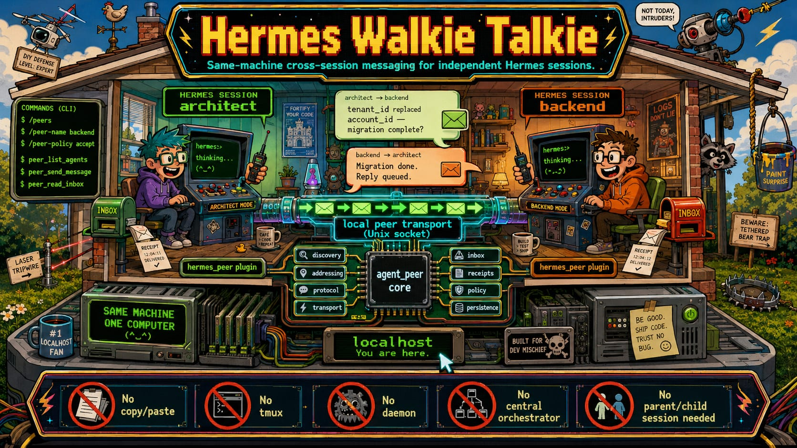

# Hermes Walkie Talkie



Hermes Walkie Talkie lets independent Hermes sessions on the same computer find one another, exchange messages and coordinate work.

It is for the ordinary case where two or more sessions are running separately and need to work together without copying text between terminals. One session can message another directly, send a request that expects a reply, or broadcast a note to a group.

Walkie Talkie is a standalone Hermes plugin. It has a small harness-neutral Python core (`agent_peer`) and a Hermes adapter (`hermes_peer`).

## What it does

- Finds live Hermes sessions owned by the same operating-system user.
- Delivers direct messages with receipts such as delivered, held, refused or unreachable.
- Assigns a stable identity to each profile and a short-lived identity to each live session.
- Supports named groups and bounded broadcasts with a result for each recipient.
- Supports structured requests with status updates, idempotency and advisory cancellation.
- Keeps a local inbox, health snapshot and content-free operational metrics.
- Adds Hermes tools and slash commands.
- Includes an optional Desktop collaboration panel. Installing it is explicit.
- Uses Unix-domain sockets on Linux and macOS, and Windows named pipes with SID-bound ACLs on Windows.

## What it does not do

Walkie Talkie is deliberately local.

- It does not connect machines over a network.
- It does not expose a TCP service or run a central daemon.
- It does not execute work remotely or transfer files.
- It does not require a parent and child session relationship.
- It does not read, publish or transmit message content as telemetry.
- Cancelling a request is advisory. It does not force-stop an active model or tool turn.

## Quick start

Install the plugin from a checkout:

```bash
hermes plugins install /path/to/hermes-walkie-talkie
```

Enable `hermes-peer` in your Hermes `config.yaml`, then restart Hermes. Open two Hermes sessions on the same machine.

In each session, set a name and choose how it handles inbound messages:

```text
/peers
/peer-name backend
/peer-policy accept
```

Then ask one session to contact the other:

```text
Tell backend that tenant_id replaced account_id and ask whether the migration is complete.
```

The agent can use `peer_list_agents`, `peer_send_message` and `peer_read_inbox` to find the other session, send the note and read the response.

For a transport-only demonstration with no API keys or Hermes install:

```bash
uv run python scripts/demo_two_sessions.py
```

It starts disposable `architect` and `backend` sessions, sends a message and reply, and records the receipts over the local transport.

## Everyday controls

| Control | Use |
|---|---|
| `/peers` | List live local peers. |
| `/peer-name <name>` | Give the current session a readable name. |
| `/peer-policy accept` | Accept inbound peer messages. |
| `peer_list_agents` | Let an agent discover addressable peers. |
| `peer_send_message` | Send a direct message. |
| `peer_read_inbox` | Read pending peer messages. |
| Group and request tools | Manage groups, broadcasts and request/reply work. |

See the command help in Hermes for the full plugin surface.

## Security boundary

Walkie Talkie trusts the local operating-system user, not every process on the network. Local paths are owner-checked, POSIX sockets verify peer credentials, and the Windows backend uses SID-bound access control lists. Message content enters Hermes as conversational input, not as a command or shell instruction.

Read the [security model](docs/security.md) before using it on a shared account or a machine where the local user boundary is not appropriate.

## Windows

Windows is supported through named pipes with SID-bound ACLs. The native Windows named-pipe and ACL suites pass on GitHub Actions `windows-latest`.

That evidence covers the transport, owner boundary and real two-process exchange. A Windows wheel-install smoke and a full Hermes Desktop/Electron interaction test are still follow-up coverage. Details are in [Windows support](docs/windows.md).

## How this relates to Hermes host controls

Walkie Talkie handles session-to-session communication: discovery, addressing, local delivery, groups and request workflows.

The related upstream Hermes work in [NousResearch/hermes-agent PR #85279](https://github.com/NousResearch/hermes-agent/pull/85279) handles host-side delivery controls. It provides queued, steering and interrupting injection modes, with safeguards so injected content cannot become slash commands or shell control.

These pieces fit together, but they are not the same feature. Walkie Talkie does not itself provide a complete live inspection surface for every subagent, and it does not replace Hermes host-side control.

## Verification

The current PR branch has passed its GitHub Actions matrix:

- Python 3.11, 3.12 and 3.13 on Ubuntu and macOS.
- Desktop build, typecheck, lint and tests on Ubuntu, macOS and Windows.
- Native Windows named-pipe and ACL tests on `windows-latest`.

The review evidence is in [docs/review](docs/review/HANDOFF.md).

## Development

```bash
uv sync --group dev
uv run pytest -q
uv run ruff check .
uv run ty check agent_peer hermes_peer dashboard
uv run python scripts/coverage_gate.py
uv build
uv run python scripts/verify_wheel_assets.py
```

For the optional Desktop bundle, use Node 22:

```bash
cd desktop
npm ci
npm run typecheck
npm run lint
npm test
npm run build
```

## Documentation

- [Architecture](docs/architecture.md)
- [Protocol](docs/protocol.md)
- [Security model](docs/security.md)
- [Groups and broadcasts](docs/groups-and-broadcasts.md)
- [Structured request workflows](docs/request-workflows.md)
- [Desktop plugin](docs/desktop.md)
- [Dashboard plugin](docs/dashboard-plugin.md)
- [Windows support](docs/windows.md)
- [Operations](docs/operations.md)
- [Compatibility](docs/compatibility.md)
- [Review and release evidence](docs/review/HANDOFF.md)

## Status

V1.1 is an open release candidate in [PR #1](https://github.com/Sahil-SS9/hermes-walkie-talkie/pull/1). The code and CI are green. A merge does not publish the package, install the plugin or activate it in a live profile.

## License

MIT. See [LICENSE](LICENSE).
