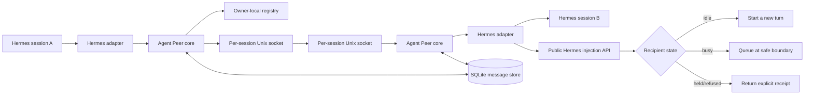

# Hermes Walkie Talkie v1 — Single-Agent `/goal` Implementation Plan

**Status:** APPROVED FOR SINGLE-SESSION `/goal` EXECUTION — no implementation started
**Created:** 9 August 2026, 13:11 BST
**Plan owner:** KENSEI
**Executor:** one agent in one dedicated Hermes session
**Post-completion review:** Sahil and/or one independent reviewer; outside the implementation goal
**Primary Hermes source:** `/home/kensei/repos/KenseiAgent`
**Planned standalone repository:** `/home/kensei/repos/hermes-walkie-talkie` (not created)
**Planned Hermes worktree:** `/home/kensei/worktrees/hermes-walkie-talkie-core` (not created)
**Source brief:** `/home/sahil/Downloads/Build_ Cross-Session Agent Messaging for AI Harnesses — Hermes First.md`

---

## 0. Binding single-agent `/goal` execution contract

This plan is now a self-contained handoff for one agent working continuously in one Hermes session. The execution model is binding:

- Use `/goal`, not `/goal route`.
- Do not create or use Kanban cards.
- Do not call `delegate_task`, spawn sub-agents, hand work to specialist profiles, use `/background`, create crons or open a second agent session.
- The same agent owns discovery, code, tests, documentation, evidence and producer self-review from P0 through P12.
- `terminal(background=true)` is allowed only for bounded builds/tests/watchers in the same agent session. The `/goal` wait barrier may park on those processes without consuming turns.
- Work sequentially by phase. Do not start phase `Pn+1` until Gate `Pn` is evidenced and the plan is updated.
- The live checklist and ledger in this file are the resume authority after context compaction. At the start of every continuation turn, inspect the plan, both Git candidates and the first unchecked in-scope task. Never restart completed work from memory.

### Goal budget preflight

The observed `goals.max_turns` value on 9 August 2026 is `20`, which is too low for this programme. Before opening the dedicated build session, record the current value and raise the budget:

```bash
install -d -m 700 /home/kensei/.hermes/state
hermes config get goals.max_turns > /home/kensei/.hermes/state/hermes-walkie-talkie-goal-max-turns.before
hermes config set goals.max_turns 200
```

Start a fresh dedicated Hermes session after changing the value so its `GoalManager` captures the 200-turn budget. Hermes has no safe unbounded goal mode: if 200 turns are exhausted, the loop pauses and only the user may issue `/goal resume`. Do not implement a recursive self-resumer or scheduler to bypass that backstop.

### Exact `/goal` command

Paste this as one multiline command in the dedicated session:

```text
/goal Build a local, review-ready v1 of Hermes Walkie Talkie. Create the new Git repository at /home/kensei/repos/hermes-walkie-talkie and execute every in-scope implementation task in /home/kensei/.hermes/plans/2026-08-09_131139-agent-peer-hermes-v1.md from P0 through P12. Continue from the first unchecked task until the deterministic completion verifier passes. Do not stop at analysis, scaffolding, a partial phase or a producer claim.
outcome: A clean local Hermes Walkie Talkie repository and a clean isolated Hermes-core candidate worktree exist at exact committed SHAs; every P0-P12 task and phase gate is evidenced; the completed plan and independent-review packet are ready for Sahil or another reviewer.
verify: From /home/kensei/repos/hermes-walkie-talkie, `uv run python scripts/verify_goal_completion.py --plan /home/kensei/.hermes/plans/2026-08-09_131139-agent-peer-hermes-v1.md` exits 0; all targeted and full test, lint, type, coverage, build, disposable-install and cross-surface E2E gates pass on the exact candidate SHAs; both Git worktrees are clean; zero release no-go blocker is observed.
constraints: One agent and one Hermes session only. No Kanban, /goal route, delegation, sub-agents, cron or background agent sessions. Use RED→GREEN TDD, isolated branches/worktrees, public Hermes APIs only and the plan's evidence rules. Do not push, open a PR, merge the Hermes candidate into the canonical checkout, tag a release, publish packages, enable the plugin in a live profile or mutate live gateways.
boundaries: Writes are limited to /home/kensei/repos/hermes-walkie-talkie, /home/kensei/worktrees/hermes-walkie-talkie-core, this plan file, disposable temporary test homes, standard user-owned build/package caches and the named goal-budget state file. Existing caches may be reused but not purged. /home/kensei/repos/KenseiAgent is read-only except for creating the isolated worktree from its committed base. Existing unrelated dirty files there must remain untouched.
stop when: Stop and report BLOCKED, with evidence in the plan ledger, if progress requires credentials, paid services, destructive cleanup, a push/PR/tag/publication, a live plugin/gateway activation, canonical-branch mutation, weakening a security/test gate, an unresolved upstream contract choice that changes scope, or user judgement. Do not guess or silently bypass the boundary.
```

### Exact `/subgoal` criteria

Add these criteria to the active goal. They reinforce the completion contract; they do not create tasks, workers or separate sessions:

```text
/subgoal Keep execution strictly inside this one session and one agent; never use Kanban, /goal route, delegate_task, /background, cron or sub-agents.
/subgoal Create the repository exactly at /home/kensei/repos/hermes-walkie-talkie, preserve the harness-neutral agent_peer protocol/package boundary, and keep /home/kensei/repos/KenseiAgent and its unrelated dirty files untouched.
/subgoal Execute P0 through P12 in dependency order, updating this plan's checkboxes, Status line and append-only evidence ledger immediately after each completed task and phase gate.
/subgoal For every behavioural change, capture an intended RED failure, GREEN targeted proof, applicable regression proof and a commit SHA before marking the item complete.
/subgoal Do not push, publish, tag, open a PR, merge into the canonical Hermes checkout, install into a live HERMES_HOME or activate/restart any live gateway; produce review-ready local candidates only.
/subgoal Finish only when the deterministic goal-completion verifier, complete local test matrix, security/no-go audit, disposable install/E2E proof and clean-worktree checks pass at the final candidate SHAs.
/subgoal Produce a self-contained independent-review packet and a final response under 4 KB that gives concrete evidence for each of these seven criteria, exact SHAs, tests, known limitations and any deferred external action.
```

Use `/goal show` and `/subgoal` to confirm the contract and all seven numbered criteria are present. User messages pre-empt the loop; avoid sending ordinary chat while it is executing unless intentionally steering or stopping it.

### Goal completion scope

The goal may be declared `COMPLETE` only when:

1. G-001 and all P0-P12 summary boxes are checked.
2. Every detailed task with prefix `AP-`, `H-`, `HP-`, `E2E-`, `SEC-`, `REL-` or `PILOT-` is checked and represented in the ledger.
3. Every release-acceptance box is checked.
4. Every release no-go box remains unchecked and the review packet explicitly records `observed_no_go_blockers: 0`.
5. The final verifier exits zero against the live plan and both exact candidate SHAs.

The independent review, Sahil feedback, remediation of review findings, upstream PR submission, public release and live activation are deliberately **post-goal**. They are not implementation-completion criteria and must not be performed by this `/goal` loop.

### Post-goal independent review and feedback workflow

After the implementation goal stops `COMPLETE`:

1. Give the reviewer `/home/kensei/repos/hermes-walkie-talkie/docs/review/HANDOFF.md`, the repository path and the isolated Hermes candidate path/SHA. The reviewer starts read-only and verifies the exact candidate rather than trusting the producer summary.
2. Findings must name severity, requirement/task ID, file and line/symbol, reproduction or failing command, expected behaviour and recommended disposition. Keep producer claims and reviewer verdicts separate.
3. Sahil accepts, rejects or modifies each finding. Review feedback alone does not authorise edits, merge, publication or activation.
4. If remediation is approved, start a new dedicated single-agent `/goal` scoped only to the accepted findings. Reopen affected plan tasks/gates, preserve original evidence, append correction evidence and rerun the full exact-candidate completion verifier.
5. Only after the remediated candidate passes independent review may Sahil separately authorise upstream PR submission, canonical convergence, release tagging/publication and live pilot/activation.

### Required final response shape

```text
GOAL RESULT: COMPLETE | BLOCKED
Subgoal evidence:
1. Single-session/no-delegation proof: <evidence>
2. Repository/canonical-cleanliness proof: <evidence>
3. P0-P12 checklist/ledger proof: <evidence>
4. RED→GREEN/commit proof: <evidence>
5. No external/live side-effect proof: <evidence>
6. Exact-candidate verification proof: <evidence>
7. Independent-review handoff proof: <evidence>
Hermes Walkie Talkie: <branch> @ <full SHA>; clean=<yes/no>
Hermes core candidate: <branch> @ <full SHA>; clean=<yes/no>
Plan verifier: <command> → <exit/result>
Tests: <exact final commands and totals>
Coverage/build/install/E2E: <results>
No-go blockers observed: <0 or list>
External side effects: no push, PR, merge, tag, publish or live activation
Review packet: <absolute path>
Known limitations/deviations: <list or none>
```

---

## 1. Decision

Build an open-source, same-machine peer-messaging system in a new public project named **Hermes Walkie Talkie**, with:

1. a harness-neutral Python core named **Agent Peer** (`agent_peer` and protocol `agent-peer/1` remain stable implementation names);
2. a thin Hermes adapter/plugin named **Hermes Peer**; and
3. the smallest generic Hermes core change needed for safe, targeted message delivery.

Do **not** use `agmsg` as the foundation. It may become an optional adapter later.

Do **not** ship a plugin that reaches into Hermes private fields such as `_cli_ref`, `_pending_input`, or `_interrupt_queue`. If the required public host API is unavailable, fail clearly rather than silently degrading.

### Why two workstreams are necessary

- The standalone repository owns discovery, Unix sockets, envelopes, receipts, persistence, policies and user-facing peer tools.
- Hermes core owns safe delivery into a live conversation. It must queue peer messages without interrupting active tools and must target the correct CLI, TUI or gateway session.

### Upstream work to converge, not duplicate

Before touching Hermes core, re-check and reconcile:

- [Hermes issue #81885](https://github.com/NousResearch/hermes-agent/issues/81885) — local cross-session messaging proposal.
- [PR #64436](https://github.com/NousResearch/hermes-agent/pull/64436) — plugin injection into existing gateway sessions.
- [PR #70406](https://github.com/NousResearch/hermes-agent/pull/70406) — owner-local IPC into an exact live gateway session.
- [PR #80920](https://github.com/NousResearch/hermes-agent/pull/80920) — targeted dashboard/TUI session injection.

As of this plan, all four are open. Implementation must reuse merged work where available or prepare a clearly reconciled local patch rather than creating an incompatible route. Do not contact authors, push branches or open/update PRs during this goal.

---

## 2. Scope

### v1 includes

- Discovery of independent local agent sessions owned by the same OS user.
- Sessions from different Hermes profiles, terminals and Git worktrees.
- One Unix-domain socket endpoint per peer session.
- One lightweight transport supervisor per process; no background daemon.
- Point-to-point text messages and replies.
- Transport acknowledgements and explicit delivery states.
- Inbound `accept`, `hold` and `refuse` policies.
- Immediate idle delivery and safe busy-session queueing.
- CLI, Hermes TUI/dashboard and gateway session support.
- Persistent inbox/outbox records and duplicate suppression.
- Tool, slash-command and CLI interfaces.
- Secure local permissions, same-user credential checks and bounded payloads.
- Linux as the release-blocking platform for the local review candidate. Configure macOS CI and platform tests, but record macOS execution as post-goal/unverified until an approved remote CI run exists.

### v1 excludes

- Cross-machine networking.
- Windows named-pipe implementation.
- Broadcasts, groups or team orchestration.
- File transfer or binary attachments.
- Shared memory, task scheduling or remote execution.
- Automatic peer-to-peer delegation.
- MCP as the primary transport.
- A permanent broker or daemon.
- Automatic execution of slash commands contained in peer messages.

---

## 3. Architecture



### Process model

- `PeerRuntimeManager` is process-global.
- It owns one daemon thread and a `selectors.DefaultSelector` loop.
- Each live conversation registers its own Unix socket with that supervisor.
- A CLI process normally owns one peer.
- A TUI or gateway process may own several peers without creating one thread per session.
- Hermes lifecycle hooks register, update and remove peers.
- Socket cleanup is also protected by `atexit` and stale-registry recovery.

### Repository boundaries

#### Standalone repository: `/home/kensei/repos/hermes-walkie-talkie`

```text
hermes-walkie-talkie/
├── plugin.yaml
├── __init__.py                  # GitHub-installed Hermes plugin entry
├── pyproject.toml
├── README.md
├── CHANGELOG.md
├── LICENSE
├── agent_peer/                  # Harness-neutral package
│   ├── __init__.py
│   ├── codec.py
│   ├── constants.py
│   ├── errors.py
│   ├── identity.py
│   ├── models.py
│   ├── paths.py
│   ├── policy.py
│   ├── presence.py
│   ├── registry.py
│   ├── runtime.py
│   ├── store.py
│   └── transport.py
├── hermes_peer/                 # Hermes-only adapter
│   ├── __init__.py
│   ├── commands.py
│   ├── config.py
│   ├── delivery.py
│   ├── plugin.py
│   ├── sessions.py
│   └── tools.py
├── skills/
│   └── peer-messaging/
│       └── SKILL.md
├── docs/
│   ├── architecture.md
│   ├── protocol.md
│   ├── security.md
│   ├── troubleshooting.md
│   ├── adr/
│   └── review/
│       ├── HANDOFF.md
│       ├── VERIFICATION.md
│       ├── DEVIATIONS.md
│       └── completed-plan.md
├── scripts/
│   ├── demo_two_sessions.py
│   └── verify_goal_completion.py
└── tests/
    ├── unit/
    ├── integration/
    ├── e2e/
    └── fixtures/
```

The public project and distribution name are `Hermes Walkie Talkie` / `hermes-walkie-talkie`. The harness-neutral Python package remains `agent_peer`, the Hermes adapter remains `hermes_peer`, and the wire protocol remains `agent-peer/1`; branding must not leak Hermes assumptions into the core. The repository root contains `plugin.yaml` and `__init__.py` so `hermes plugins install owner/repo` works without adding `src/` to `sys.path`. `pyproject.toml` also exposes a `hermes_agent.plugins` entry point for normal package installation.

#### Hermes candidate worktree: `/home/kensei/worktrees/hermes-walkie-talkie-core`

Expected touch points, subject to the upstream convergence spike:

```text
hermes_cli/plugins.py
hermes_cli/plugin_message_router.py       # new only if a shared router is justified
cli.py
tui_gateway/server.py
gateway/run.py
gateway/session.py
gateway/platforms/base.py
tests/hermes_cli/test_plugin_message_injection.py
tests/test_tui_gateway_inject.py
tests/gateway/test_plugin_message_injection.py
website/docs/user-guide/features/plugins.md
```

Do not edit agent runtime files unless a failing RED test proves the public delivery contract cannot be implemented at the host boundary.

---

## 4. Contracts to lock before implementation

### 4.1 Peer identity

- `peer_id`: immutable UUID for one live peer registration.
- `instance_id`: random UUID for one process incarnation; prevents PID-reuse mistakes.
- `session_id`: current Hermes conversation ID; metadata that may change on reset or rotation.
- `host_target`: opaque Hermes-owned routing token used only by `hermes_peer`.
- `name`: human-readable alias; defaults to `<repo-or-cwd>-<short-id>` and may be changed.
- `profile`: Hermes profile name.
- `surface`: `cli`, `tui`, `gateway` or future adapter name.

The harness-neutral core never interprets `host_target`.

### 4.2 Public Hermes delivery seam

Target contract, preserving the existing Boolean return type:

```python
ctx.inject_message(
    content,
    role="user",
    *,
    mode="queue",            # queue | steer | interrupt
    target_session=None,     # opaque exact-session target
) -> bool
```

Required behaviour:

- `queue` is the peer-messaging default.
- Idle target: start a new turn.
- Busy target: wait until a safe boundary; never terminate the active tool.
- `steer`: explicit mid-turn steering where the host supports it.
- `interrupt`: existing hard-interrupt behaviour, retained for compatibility.
- Unknown, closed or unauthorised targets fail closed.
- Injected text is conversational input only; it cannot invoke slash commands, approve tools or answer protected confirmation/clarification prompts.
- Gateway injection remains disabled per plugin unless `allow_gateway_injection: true` is explicitly set.

The host seam deliberately keeps its existing Boolean result for compatibility. Structured `queued`/`held`/`refused` receipts belong to Agent Peer's transport contract, where they can evolve without breaking existing Hermes plugins. Replacing the existing Boolean with a dataclass would not be an additive change for callers that compare with `True` or serialise the result.

The exact parameter name may follow an accepted upstream PR (`session_id` or `session_key`), but `hermes_peer` must hide that detail behind `HostSessionTarget`.

### 4.3 Envelope v1

Required fields:

```json
{
  "protocol": "agent-peer/1",
  "message_id": "uuid",
  "created_at": "RFC3339 UTC",
  "expires_at": "RFC3339 UTC",
  "sender": {"peer_id": "uuid", "name": "...", "profile": "..."},
  "recipient_peer_id": "uuid",
  "kind": "message",
  "content": "text",
  "reply_to": null,
  "conversation_id": null,
  "hop_count": 0
}
```

Allowed `kind` values: `ping`, `pong`, `message`, `receipt`.

Immediate receipt states:

- `queued`
- `held`
- `refused`
- `unreachable`
- `expired`
- `invalid`
- `rate_limited`
- `over_capacity`

### 4.4 Limits and defaults

- Content: 32 KiB UTF-8 maximum.
- Full framed envelope: 64 KiB maximum.
- Length-prefixed JSON over `AF_UNIX` + `SOCK_STREAM`.
- Default message TTL: 5 minutes.
- Connect timeout: 1 second.
- Receipt timeout: 3 seconds.
- Heartbeat interval: 15 seconds.
- Stale threshold: 45 seconds, followed by a socket handshake before removal.
- Maximum hop count: 4.
- Rate limit: burst 5, sustained 20 messages per minute per sender/recipient pair.
- Pending inbox capacity: 100 messages per peer.
- Default inbound policy: `accept`.

All limits are configurable within safe hard ceilings; invalid values fail configuration validation.

### 4.5 Runtime and persistent paths

Shared owner-local paths are required so different Hermes profiles can discover each other.

- Runtime registry and sockets:
  - Linux: `$XDG_RUNTIME_DIR/agent-peer/` when secure and available.
  - Fallback/macOS: an owner-verified `0700` directory with a short Unix-socket-safe path.
- Persistent state:
  - `${XDG_STATE_HOME:-~/.local/state}/agent-peer/messages.sqlite3`
- Runtime directories: mode `0700`.
- Registry files, sockets where supported, and SQLite database: owner-only (`0600` or stricter).
- Refuse symlinked or wrong-owner runtime paths.

No transport path is placed under a profile-specific `HERMES_HOME` by default.

---

## 5. Mark-off rules

A checkbox may be changed to `[x]` only when all of the following exist:

1. an isolated branch/worktree;
2. the relevant RED test observed failing for the intended reason;
3. GREEN targeted tests;
4. no unexplained regression in the owning repository;
5. a commit SHA; and
6. an evidence entry in the progress ledger at the end of this plan.

A phase is not complete until its gate passes. Agent self-report alone is not evidence.

Use this evidence format:

```text
Task: AP-000
Commit: <sha>
RED: <command and expected failure>
GREEN: <command and result>
Regression: <command and result>
Notes: <risk, deviation or none>
```

---

## 6. Master checklist

### Discovery and planning

- [x] D-001 Scan public implementations and inspect the strongest candidates.
- [x] D-002 Verify current Hermes plugin, hook and injection primitives.
- [x] D-003 Verify Claude Code's native cross-session behaviour.
- [x] D-004 Decide build-versus-adapt: build a new open core and Hermes adapter.
- [x] D-005 Produce this phased implementation plan and checklist.
- [x] G-001 Sahil explicitly authorised implementation through one dedicated in-session `/goal` on 9 August 2026; no Kanban or delegated workers.

### Implementation phases

- [ ] P0 — Freeze architecture and reconcile upstream work.
- [ ] P1 — Land or adopt the generic Hermes delivery seam.
- [ ] P2 — Scaffold the standalone repository and CI.
- [ ] P3 — Implement protocol models, validation and codec.
- [ ] P4 — Implement secure paths, identity, registry and presence.
- [ ] P5 — Implement Unix-socket transport and process supervisor.
- [ ] P6 — Implement persistence, policies, receipts and deduplication.
- [ ] P7 — Implement Hermes lifecycle and delivery adapter.
- [ ] P8 — Implement tools, slash commands, CLI and bundled skill.
- [ ] P9 — Complete cross-surface integration and end-to-end tests.
- [ ] P10 — Complete security, concurrency and recovery hardening.
- [ ] P11 — Package and document a local review candidate without publishing it.
- [ ] P12 — Complete disposable pilots, freeze exact candidates and write the independent-review handoff.

---

## 7. Detailed implementation checklist

## Phase P0 — Architecture freeze and upstream convergence

**Goal:** remove design ambiguity before production code.

- [x] **AP-001 — Refresh upstream evidence.** Re-check `main`, issue #81885 and PRs #64436, #70406 and #80920 immediately before branching.
- [x] **AP-002 — Create isolated workspaces.** Create `/home/kensei/worktrees/hermes-walkie-talkie-core` from fresh upstream-equivalent history and initialise `/home/kensei/repos/hermes-walkie-talkie` without touching the canonical KenseiAgent worktree or its unrelated dirty files.
- [x] **AP-003 — Write ADR-0001.** Lock repository boundaries, per-process supervisor, per-session sockets, shared owner-local runtime root and no-daemon rule.
- [x] **AP-004 — Write ADR-0002.** Lock the opaque Hermes target-session contract and queue/steer/interrupt semantics.
- [x] **AP-005 — Write ADR-0003.** Lock envelope v1, receipts, limits, TTL, rate limits and duplicate semantics.
- [x] **AP-006 — Define compatibility policy.** Record the minimum Hermes version/feature check; ban private-field fallback.
- [x] **AP-007 — Record the architecture validation.** The single executor checks the three ADRs against the source brief, current Hermes code and P0 gate, records assumptions/deviations and proceeds only when no ambiguity remains. Independent judgement is deliberately deferred to post-goal review.

**Gate P0:** all three ADRs recorded and internally validated; no unresolved session-targeting or busy-delivery ambiguity. **PASSED — see ledger.**

---

## Phase P1 — Generic Hermes delivery seam

**Goal:** make safe, targeted plugin delivery a supported public Hermes capability.

### RED tests first

- [x] **H-101 — CLI idle RED test.** A queued plugin message starts one new turn when CLI is idle.
- [x] **H-102 — CLI busy RED test.** `mode="queue"` does not touch `_interrupt_queue` and is delivered after the active tool boundary.
- [x] **H-103 — Explicit interrupt RED test.** `mode="interrupt"` preserves current behaviour.
- [x] **H-104 — Exact TUI target RED test.** Busy and idle dashboard sessions receive only their own targeted message.
- [x] **H-105 — Exact gateway target RED test.** The gateway reuses the existing authorised route and queues behind active work.
- [x] **H-106 — Closed-target RED test.** Closed, rotated, unknown or unauthorised sessions fail closed.
- [x] **H-107 — Inert-control RED test.** `/approve`, `/stop`, clarification answers and slash commands injected by a plugin remain ordinary conversational text.
- [x] **H-108 — Backwards-compatibility RED test.** Existing two-argument `inject_message(content, role)` callers behave unchanged.

### Implementation

- [x] **H-109 — Reuse upstream work.** Cherry-pick/rebase/adapt any merged or accepted parts of #64436, #70406 and #80920.
- [x] **H-110 — Add mode selection.** Extend the public API with safe queueing while retaining explicit steer and interrupt paths.
- [x] **H-111 — Add exact target metadata.** Expose an opaque target through session lifecycle/tool context without leaking platform routing internals to plugins.
- [x] **H-112 — Add host routing.** Route through CLI, TUI and gateway host-owned queues rather than plugin-owned private access.
- [x] **H-113 — Preserve gateway authorisation.** Require `allow_gateway_injection: true`; revalidate the stored route; fail closed on config errors.
- [x] **H-114 — Document the contract.** Update public plugin docs with target, mode, permissions and guarantees.
- [x] **H-115 — Run targeted regression.** Execute all injection, session, gateway busy-queue and TUI tests.
- [x] **H-116 — Run full Hermes regression.** Run the repository's complete test suite on the exact candidate commit.
- [x] **H-117 — Prepare upstream-ready patch evidence.** Reconcile with existing work and produce a local commit series plus draft PR description explaining issue #81885 compatibility. Do not push, open a PR or merge into the canonical checkout during the goal.

**Expected files:** `hermes_cli/plugins.py`, host router if justified, `cli.py`, `tui_gateway/server.py`, `gateway/run.py`, associated tests and plugin docs.

**Gate P1:** public API works on CLI, TUI and gateway; all RED tests are GREEN; no peer-specific code exists in Hermes core. **PASSED — see ledger.**

---

## Phase P2 — Standalone repository scaffold

**Goal:** create a clean, installable and independently testable public project.

- [x] **AP-201 — Initialise repository.** Use `main`, MIT licence, README, changelog and `.gitignore`.
- [x] **AP-202 — Add package metadata.** Python `>=3.11,<3.14`; exact development dependency pins in a PEP 735 `dev` dependency group; no runtime dependency unless justified by ADR.
- [x] **AP-203 — Add Hermes entry points.** Root `plugin.yaml`, root `__init__.py` and `hermes_agent.plugins` package entry point.
- [x] **AP-204 — Add test layout.** Unit, integration, E2E and fixture directories.
- [x] **AP-205 — Add quality tooling.** Pytest, Hypothesis, pytest-cov, Ruff and `ty`; explicit UTF-8 file handling.
- [x] **AP-206 — Add CI.** Configure Linux and macOS jobs for Python 3.11–3.13 with no external service/API-key requirement. Run the Linux-equivalent matrix locally; do not claim the macOS lane executed before approved remote CI.
- [x] **AP-207 — Verify clean installation.** Install from local path and GitHub-style cloned layout into a temporary Hermes home.
- [x] **AP-208 — Add the goal-completion verifier.** `scripts/verify_goal_completion.py --plan <path>` must fail non-zero for any incomplete in-scope task/phase/acceptance item, missing ledger evidence, checked no-go blocker, missing review packet, dirty candidate or absent final SHA evidence; it must pass only at the true P12 candidate.

**Gate P2:** empty plugin loads successfully, test and lint jobs pass, and clone-based Hermes installation works. **PASSED — see ledger.**

---

## Phase P3 — Protocol models and codec

**Goal:** build a deterministic, versioned and bounded protocol independent of Hermes.

- [x] **AP-301 — RED envelope validation tests.** Missing fields, wrong types, unknown version, invalid UUID/time, excessive hops and expired messages.
- [x] **AP-302 — RED framing tests.** Partial frames, multiple frames, oversized frames, invalid UTF-8 and malformed JSON.
- [x] **AP-303 — Implement immutable models.** `PeerIdentity`, `PeerRecord`, `Envelope`, `Receipt` and status enums.
- [x] **AP-304 — Implement canonical JSON codec.** Stable serialisation for tests and logs; no executable object deserialisation.
- [x] **AP-305 — Implement length-prefixed framing.** Reject before allocating beyond the hard envelope ceiling.
- [x] **AP-306 — Add protocol compatibility tests.** v1 accepts v1; unknown major versions return `invalid` without crashing.
- [x] **AP-307 — Document protocol v1.** Include schema, examples, limits and forward-compatibility rules.
- [x] **AP-308 — Add protocol property tests.** Generate at least 200 valid/invalid envelopes and prove canonical round-trip, bounded allocation and deterministic rejection.

**Gate P3:** 100% of protocol/error branches exercised; package has no Hermes import. **PASSED — see ledger.**

---

## Phase P4 — Secure paths, identity, registry and presence

**Goal:** discover only genuine, same-user, reachable peers.

- [x] **AP-401 — RED secure-path tests.** Wrong owner, permissive mode, symlink, path traversal and overlong socket paths.
- [x] **AP-402 — Implement runtime-path selection.** Secure XDG path plus short verified fallback.
- [x] **AP-403 — Implement identity generation.** Unique peer and instance IDs; stable host metadata; explicit alias persistence.
- [x] **AP-404 — Implement atomic registry writes.** Temp file, `fsync` where required, `os.replace`, mode `0600`.
- [x] **AP-405 — Implement presence updates.** `idle`, `working`, `held`, `closing`; bounded heartbeat writes.
- [x] **AP-406 — Implement reachability checks.** Heartbeat is a hint; socket ping/instance handshake is authoritative.
- [x] **AP-407 — Protect against PID reuse.** Registry PID never proves identity without matching socket `instance_id`.
- [x] **AP-408 — Implement stale cleanup.** Remove only after expiry plus failed handshake; never delete another live instance's files.
- [x] **AP-409 — Test collisions.** Duplicate names remain distinct; exact IDs are deterministic tiebreakers.
- [x] **AP-410 — Test cross-profile discovery.** Separate `HERMES_HOME` values under the same UID share the owner-local registry.
- [x] **AP-411 — Test concurrent alias updates.** Simultaneous name changes always leave a parseable atomic registry record; ambiguity is reported rather than guessed.

**Gate P4:** three simulated profiles/worktrees discover one another; stale and malicious entries cannot impersonate a live peer. **PASSED — see ledger.**

---

## Phase P5 — Unix-socket transport and supervisor

**Goal:** deliver envelopes reliably without a daemon or unbounded threads.

- [x] **AP-501 — RED supervisor lifecycle tests.** First session starts it; additional sessions share it; last session stops it.
- [x] **AP-502 — RED transport tests.** Success, timeout, disconnect, partial write/read and malformed peer response.
- [x] **AP-503 — Implement selector supervisor.** One process-level thread manages multiple per-session sockets.
- [x] **AP-504 — Implement sender client.** Connect, frame, send, await bounded receipt and close.
- [x] **AP-505 — Verify peer credentials.** Linux `SO_PEERCRED`; macOS owner credential equivalent; reject a different UID.
- [x] **AP-506 — Bound resources.** Connection cap, frame cap, timeouts and backpressure; no thread per message.
- [x] **AP-507 — Implement graceful teardown.** Unregister selector, close socket, unlink exact owned path and remove registry file.
- [x] **AP-508 — Implement crash recovery.** New process can reclaim only its verified stale path.
- [x] **AP-509 — Concurrency test.** Concurrent senders do not interleave frames or lose receipts.
- [x] **AP-510 — Idle resource test.** No busy loop; negligible CPU while no messages arrive.
- [x] **AP-511 — Slow-client isolation test.** A client that stalls mid-frame cannot block other peers or the selector loop.
- [x] **AP-512 — Handler-failure recovery test.** A malformed connection or injected handler exception is contained; the supervisor remains available to later clients.

**Gate P5:** reliable point-to-point ping and message acknowledgements across independent Python processes on Linux; macOS-specific code/tests and CI configuration are present, with runtime execution explicitly deferred to post-goal remote CI. **PASSED (in-process real-socket integration; cross-PROCESS proof at E2E-901).**

---

## Phase P6 — Persistence, policies, receipts and deduplication

**Goal:** make delivery state explicit and crash-safe.

- [x] **AP-601 — RED SQLite migration tests.** Fresh DB, repeated migration and simulated older schema.
- [x] **AP-602 — Implement owner-local store.** WAL mode, busy timeout, transactions and bounded retention.
- [x] **AP-603 — Implement deduplication.** Same `message_id` is stored/delivered once and returns the prior receipt thereafter.
- [x] **AP-604 — Implement accept policy.** Store and forward to harness; return `queued` only after host acceptance.
- [x] **AP-605 — Implement hold policy.** Persist without forwarding; expose release/refuse actions.
- [x] **AP-606 — Implement refuse policy.** Persist minimal audit metadata; never forward content.
- [x] **AP-607 — Implement reply correlation.** Validate `reply_to`; preserve conversation ID without automatic ping-pong.
- [x] **AP-608 — Implement rate and capacity limits.** Return explicit non-success receipts.
- [x] **AP-609 — Implement TTL handling.** Expired messages never reach the harness.
- [x] **AP-610 — Add retention maintenance.** Time/row bounded cleanup that never blocks active delivery.
- [x] **AP-611 — Test process crashes.** Committed records survive; partial transactions do not.
- [x] **AP-612 — Add idempotency property tests.** Generate retries, duplicate IDs and reply correlations; prove one delivery per message ID and no reply leakage across peers.

**Gate P6:** policy and receipt state survives restart, duplicate sends are idempotent, and every rejection is visible to the sender. **PASSED — see ledger.**

---

## Phase P7 — Hermes lifecycle and delivery adapter

**Goal:** connect the generic core to Hermes using public APIs only.

- [x] **HP-701 — RED lifecycle tests.** Start, post-turn idle, reset, session rotation, finalise and abnormal process exit.
- [x] **HP-702 — Implement config loader.** Read receiver-owned settings from `plugins.entries.hermes-peer.settings`; validate and fail clearly.
- [x] **HP-703 — Implement session manager.** Map Hermes session lifecycle to `PeerRuntimeManager` registrations.
- [x] **HP-704 — Capture host target safely.** Capture context-bound target before starting listener work; never rely on inherited thread context.
- [x] **HP-705 — Implement status mapping.** `on_session_start`/turn hooks set working state; `on_session_end` sets idle; finalise removes registration.
- [x] **HP-706 — Implement safe delivery.** Wrap peer text as untrusted peer input and call public `ctx.inject_message(..., mode="queue", target_session=...)`.
- [x] **HP-707 — Feature-detect Hermes support.** Unsupported hosts produce a clear doctor/install error; no private fallback.
- [x] **HP-708 — Test multiple sessions per host.** A TUI/gateway process can register several exact peers through one supervisor.
- [x] **HP-709 — Test reset/resume.** Alias and relevant inbox state survive a resumed Hermes conversation without stale target reuse.
- [x] **HP-710 — Enforce adapter boundaries.** A structural test fails if `hermes_peer` imports Hermes private/session internals or reimplements core policy, persistence, registry or transport logic.

**Gate P7:** Hermes adapter passes lifecycle tests and contains no private-field access or imports from gateway internals. **PASSED — see ledger.**

---

## Phase P8 — Tools, commands and bundled skill

**Goal:** provide a small, predictable user and agent interface.

### Agent tools — exactly three in v1

- [x] **HP-801 — `peer_list_agents`.** Return reachable peers with ID, name, profile, surface, cwd/repo and status.
- [x] **HP-802 — `peer_send_message`.** Require exact peer ID, content and optional `reply_to`; await and return the transport receipt.
- [x] **HP-803 — `peer_read_inbox`.** List/filter held and received messages; release or refuse held messages via explicit action.

### Human commands

- [x] **HP-804 — `/peers`.** Concise peer/status list.
- [x] **HP-805 — `/peer-name <name>`.** Validate and persist a human-readable alias.
- [x] **HP-806 — `/peer-policy <accept|hold|refuse>`.** Change the receiver's policy explicitly.
- [x] **HP-807 — `/peer-inbox`.** List held messages and provide explicit release/refuse syntax.
- [x] **HP-808 — `hermes peer ...`.** Add `list`, `send`, `inbox`, `name`, `policy` and `doctor` CLI subcommands.
- [x] **HP-809 — Bundled skill.** Teach agents when to list, send and reply; forbid pretending an acknowledgement was received.
- [x] **HP-810 — Schema and usability tests.** Stable tool schemas, useful errors and no duplicate tool aliases.

**Gate P8:** a human and an agent can discover, send, hold, refuse, release and reply without reading implementation docs. **PASSED — see ledger.**

---

## Phase P9 — Cross-surface integration and E2E

**Goal:** prove the complete behaviour with real independent Hermes hosts.

- [x] **E2E-901 — Two idle CLI sessions.** Discovery, send, automatic new turn, reply and receipt.
- [x] **E2E-902 — Busy CLI recipient.** Long-running fake tool completes normally; peer message starts only at the safe boundary.
- [x] **E2E-903 — Three worktrees/profiles.** Distinct names and IDs; direct routing to the chosen peer only.
- [x] **E2E-904 — TUI idle and busy sessions.** Exact targeting with no cross-session leakage.
- [x] **E2E-905 — Gateway idle and busy sessions.** Existing authorised route only; no synthetic platform route.
- [x] **E2E-906 — Accept/hold/refuse walkthrough.** Sender sees the correct state each time.
- [x] **E2E-907 — Crash/restart walkthrough.** No stale peer is reported reachable; new process registers cleanly.
- [x] **E2E-908 — Resume/reset walkthrough.** No delivery to the previous route after rotation.
- [x] **E2E-909 — Clean install test.** Temporary `HERMES_HOME`, GitHub-style install, enable, restart, uninstall and cleanup.
- [x] **E2E-910 — Real-binary disposable smoke test.** Two isolated local Hermes sessions under temporary homes exchange a harmless message without model/tool interruption; do not enable the plugin in any live profile.

**Gate P9:** all source-brief acceptance scenarios pass on an exact committed candidate. **PASSED — see ledger.**

---

## Phase P10 — Security, concurrency and recovery hardening

**Goal:** fail closed under hostile local input and process races.

- [x] **SEC-1001 — Permissions audit.** Runtime dirs `0700`; records/DB owner-only; wrong-owner paths rejected.
- [x] **SEC-1002 — Symlink/race audit.** Cover registry replacement, socket reclaim and cleanup TOCTOU cases.
- [x] **SEC-1003 — Same-UID audit.** Deterministic tests plus real cross-UID Linux validation in an isolated environment.
- [x] **SEC-1004 — Payload fuzzing.** Truncated, oversized, nested, malformed and unknown-version input cannot crash the supervisor.
- [x] **SEC-1005 — Control injection audit.** Peer text cannot approve tools, invoke slash commands or bypass confirmation gates.
- [x] **SEC-1006 — Prompt-boundary audit.** The recipient sees sender identity and an explicit untrusted-message boundary.
- [x] **SEC-1007 — Loop audit.** Hop limit, duplicate IDs and no automatic reply prevent ping-pong storms.
- [x] **SEC-1008 — Flood audit.** Rate/capacity limits keep memory, DB and CPU bounded.
- [x] **SEC-1009 — Concurrency stress.** Multiple senders, multiple sessions in one process, shutdown during send and DB contention.
- [x] **SEC-1010 — Static checks.** No shell interpolation, unsafe deserialisation, world-writable paths, private Hermes fields, silent exception swallowing, `TODO`/`FIXME` placeholders or commented-out implementation code.
- [x] **SEC-1011 — Producer QA audit.** The single executor independently reruns the exact-candidate security, concurrency, recovery and release gates from a clean state and records direct evidence. This is not a substitute for the post-goal independent review.
- [x] **SEC-1012 — No-network audit.** Prove the feature opens Unix-domain sockets only and no TCP listener under any supported configuration.
- [x] **SEC-1013 — Log-redaction audit.** Routine/security logs contain message IDs, sender IDs, sizes and outcomes, not raw message bodies.
- [x] **SEC-1014 — Storage-failure audit.** Disk-full, read-only and partial-write failures return an observable error without crashing Hermes or corrupting existing state.
- [x] **SEC-1015 — Coverage gate.** `agent_peer` and `hermes_peer` reach at least 90% line coverage and 85% branch coverage on trust and delivery paths.

**Gate P10:** no critical/high security finding, no known message loss or session leak, and every failure is observable. **PASSED — see ledger (final coverage numbers confirmed at clean-candidate rerun, P11/P12).**

---

## Phase P11 — Packaging, documentation and local review candidate

**Goal:** make the project installable, understandable and maintainable, while keeping every external publication action deferred.

- [x] **REL-1101 — README quick start.** Install, enable, open two sessions, list, send and reply.
- [x] **REL-1102 — Architecture and protocol docs.** Process model, state paths, wire format and extension points.
- [x] **REL-1103 — Security doc.** Same-user boundary, threat model, permissions, limits and non-goals.
- [x] **REL-1104 — Troubleshooting/doctor.** Missing Hermes seam, unsafe paths, stale sockets and unsupported platforms.
- [x] **REL-1105 — Compatibility matrix.** Minimum Hermes commit/version and tested Python/OS versions; mark macOS as configured-but-unverified rather than implying a remote CI run occurred.
- [x] **REL-1106 — Example demo.** Deterministic two-session script with no external API key.
- [x] **REL-1107 — Full clean candidate verification.** Fresh clone and lockfile, all tests/lints, clean Git status and package build.
- [x] **REL-1108 — Validate the `v0.1.0-rc1` candidate metadata.** Confirm version/package/release metadata is internally consistent, but do not create or push a Git tag.
- [x] **REL-1109 — Draft the upstream coordination note.** Link issue #81885 and the converged local Hermes candidate; do not post or publish it.
- [x] **REL-1110 — Draft release notes.** State verified capabilities, limitations and any unverified lane plainly.
- [x] **REL-1111 — Language review.** User-facing messages, commands and documentation use consistent British English; identifiers follow normal Python conventions.

**Gate P11:** installable local review candidate with reproducible evidence, no hidden Hermes patch and no external publication side effect. **PASSED — see ledger (final clean-candidate rerun at P12 freeze).**

---

## Phase P12 — Disposable pilot, candidate freeze and review handoff

**Goal:** validate normal use in disposable environments, freeze the exact producer candidates and hand them to an independent reviewer without live activation or publication.

- [x] **PILOT-1201 — Two-session disposable pilot.** Use two temporary Hermes homes and default inbound `hold`; do not touch live profile config.
- [x] **PILOT-1202 — Observe discovery and delivery.** Confirm low idle resource use and correct cleanup over normal disposable-session churn.
- [x] **PILOT-1203 — Three-profile/worktree disposable pilot.** Exercise exact direct messages, replies and collision-safe discovery.
- [x] **PILOT-1204 — Accept/hold/refuse pilot.** Confirm peer input is labelled, receipts are explicit and active tools are never interrupted.
- [x] **PILOT-1205 — Logs and retention audit.** Confirm no raw-content leakage, unbounded growth or repeated stale entries.
- [x] **PILOT-1206 — Freeze exact candidates.** Run the complete clean-candidate verification after all intended commits; record full SHAs, branches, bases and clean-status proof for both repositories.
- [x] **PILOT-1207 — Write the independent-review packet.** Populate `docs/review/HANDOFF.md`, `VERIFICATION.md` and `DEVIATIONS.md` with architecture, changed paths, direct commands/results, threat boundary, known limitations, upstream patch instructions and rollback.
- [x] **PILOT-1208 — Snapshot the completed plan.** Copy the final plan to `docs/review/completed-plan.md`, record its SHA-256, and keep this canonical plan as the live authority.
- [x] **PILOT-1209 — Run the deterministic completion verifier.** It must exit zero against this live plan and the exact final candidates.
- [x] **PILOT-1210 — Prepare goal-budget restoration.** Read `/home/kensei/.hermes/state/hermes-walkie-talkie-goal-max-turns.before` and include the exact `hermes config set goals.max_turns <previous>` command in the handoff/final response; do not mutate unrelated config.

**Gate P12:** a reviewer can reproduce the documented two/three-session workflow without extra decoding; every producer claim is backed by exact-candidate evidence; no push, PR, merge, tag, publication or live activation occurred. **PASSED — see ledger.**

Finalisation is two-pass to avoid a self-referential plan snapshot: prepare the review packet and provisional snapshot; run and record the verifier; mark the remaining P12/acceptance items and ledger evidence; overwrite `docs/review/completed-plan.md` with the now-complete live plan; update its SHA-256 record; then rerun the verifier once more. Only the second zero exit counts.

---

## 8. Test commands to use during implementation

### Hermes core worktree

```bash
uv run pytest tests/hermes_cli/test_plugin_message_injection.py -q
uv run pytest tests/test_tui_gateway_inject.py -q
uv run pytest tests/gateway/test_plugin_message_injection.py -q
uv run pytest tests/gateway tests/tui_gateway tests/hermes_cli -q
uv run ruff check hermes_cli gateway tui_gateway tests
ulimit -n 65536 && uv run pytest -q
```

Use only commands applicable to files actually present after upstream reconciliation. Record the exact commands and totals in the ledger.

### Test-discipline rules

- Write each behavioural test before its implementation and retain the observed RED evidence.
- Unit tests use fake clocks and bounded timeouts; no individual unit/integration test may depend on more than 30 seconds of wall time.
- Integration tests use real Unix sockets and subprocesses at the IPC boundary. Mock only the Hermes host-delivery seam, external platform adapter or fake LLM boundary.
- No CI test requires a real LLM, external messaging account, internet access or API key.
- Run the Linux matrix locally and validate the macOS CI definition without claiming a macOS execution. Windows remains explicitly out of scope for v1.
- Enforce at least 90% line coverage overall and 85% branch coverage on trust/delivery paths. Coverage cannot replace end-to-end evidence.

### Hermes Walkie Talkie repository

```bash
uv sync --group dev
uv run pytest tests/unit -q
uv run pytest tests/integration -q
uv run pytest tests/e2e -q
uv run pytest -q
uv run ruff check .
uv run ty check agent_peer hermes_peer
uv build
uv run python scripts/verify_goal_completion.py --plan /home/kensei/.hermes/plans/2026-08-09_131139-agent-peer-hermes-v1.md
```

### Mandatory clean-candidate checks

```bash
git status --short
git rev-parse HEAD
```

The final verification must run after all intended commits on the exact candidate SHA. Earlier test results do not count.

---

## 9. Release acceptance checklist

- [x] Independent sessions discover one another without manual IDs.
- [x] Different Hermes profiles and Git worktrees are supported.
- [x] A sender targets the intended peer by exact ID.
- [x] Idle recipients begin a new turn automatically.
- [x] Busy recipients are not interrupted; delivery waits for a safe boundary.
- [x] Replies retain `reply_to` correlation.
- [x] Accept, hold and refuse policies work and return explicit receipts.
- [x] Stale peers disappear after verified cleanup.
- [x] Duplicate sends do not duplicate agent delivery.
- [x] Crash/restart does not misroute to a reused PID or socket.
- [x] Peer messages cannot execute slash commands or approvals.
- [x] Runtime/state paths are owner-only and same-UID checks are enforced.
- [x] CLI, TUI/dashboard and gateway surfaces pass exact-target tests.
- [x] Plugin uses only public Hermes APIs.
- [x] No permanent daemon, network listener or cloud service is introduced.
- [x] No TCP listener is opened by any supported configuration.
- [x] Logs do not retain raw message bodies.
- [x] Coverage meets the 90% line / 85% trust-and-delivery branch gate.
- [x] Full tests, lint, type checks and package build pass on the exact candidate.
- [x] Clean install/uninstall is verified.
- [x] Documentation states limitations honestly.
- [x] Producer QA audit and independent-review packet are complete.
- [x] Candidate remains explicitly unreleased pending Sahil/independent review.

---

## 10. Release no-go blockers

Any one of these blocks release:

- [ ] Any peer message interrupts an active tool when queue mode was requested.
- [ ] Any peer message executes a slash command, approves a tool or answers a protected confirmation/clarification prompt.
- [ ] Any different-UID process can register, discover private metadata from or send to a peer.
- [ ] Any runtime directory, registry file or database is created with unsafe ownership or permissions.
- [ ] Any TCP listener or cloud dependency is introduced on the peer-messaging path.
- [ ] Any message is silently dropped when an explicit refusal/error receipt is possible.
- [ ] Any duplicate is delivered more than once, reply reaches the wrong session, or closed-session route receives a message.
- [ ] Any hang exceeds a configured transport or reply timeout.
- [ ] Any supervisor crash, unbounded resource growth or unrecoverable state corruption appears under concurrency/fuzz/chaos tests.
- [ ] Any CLI, TUI/dashboard or gateway exact-target gate is unverified.
- [ ] Any private Hermes-field fallback is required for the release candidate.
- [ ] Any critical/high QA or security finding remains open.
- [ ] Any push, PR creation, canonical merge, Git tag, package publication, live-profile install or gateway activation occurred during the goal.

A checked box in this section means the blocker was observed and the candidate is **NO-GO**. Keep every box unchecked for release.

---

## 11. Rollback

### Hermes core

- Keep all changes in the isolated worktree until targeted and full verification pass.
- Do not merge into the canonical KenseiAgent worktree until a reviewed exact-candidate commit exists.
- Rollback is branch/worktree removal or revert of the dedicated core commit series.

### Plugin

- Disable `hermes-peer` in plugin config and restart the affected Hermes process.
- The plugin must stop its supervisor, close sockets and remove only its own registry records.
- Persistent message state remains for audit unless the user explicitly runs the documented purge command.
- Never delete shared runtime/state roots recursively during automatic uninstall.

---

## 12. Progress ledger

Append one row per completed task. Do not rewrite historical evidence.

| Date | Task | Owner | Status | Commit | Test evidence | Notes |
|---|---|---|---|---|---|---|
| 09/08/2026 | D-001–D-004 | KENSEI/Remii/Octacon | Complete | N/A | Read-only repository and source inspection | No exact open implementation found; build recommended |
| 09/08/2026 | D-005 | KENSEI | Complete | N/A | Plan written at this path | Implementation not started |
| 09/08/2026 | QA plan review | KENSEI/Quan | Complete | N/A | Quan strategy reconciled against approved source scope | Added coverage, slow-client, handler-failure, no-TCP, log-redaction, storage-failure and no-go gates; rejected conflicting profile-isolation, steer-by-default, custom TUI pane and gateway JSON-RPC scope |
| 09/08/2026 | Coding-lead plan review | KENSEI/Octacon | Complete | N/A | Octacon strategy reconciled by KENSEI against the parent-inspected source | Added property tests, adapter-boundary enforcement, placeholder checks and language review; retained one public repository, Boolean Hermes compatibility, real UDS transport and multi-file host convergence; rejected unverified in-process-only, one-file upstream and per-turn deregistration assumptions |
| 09/08/2026 | G-001 and `/goal` execution amendment | Sahil/KENSEI | Approved | N/A | Sahil explicitly selected strict one-agent, one-session execution with independent review after completion | Renamed repository to Hermes Walkie Talkie; added 200-turn bounded goal contract, seven subgoals, deterministic completion gate, no-Kanban/no-delegation rule and review-ready/no-publication P12 boundary |
| 09/08/2026 | AP-001 | KENSEI | Complete | N/A (read-only) | GitHub API refresh of #81885, #64436, #70406, #80920 on 9 Aug 2026 | All four still open; none merged; reconciliation recorded in ADR-0002 and AP-007 |
| 09/08/2026 | AP-002 | KENSEI | Complete | wt: `candidate/hermes-walkie-talkie-p1-20260809` @ 3f812796bb (base 3f812796bb); repo: f45b0b5 | `git worktree add` OK; `git status --short` clean in both; canonical dirty files untouched | Standalone repo initialised at /home/kensei/repos/hermes-walkie-talkie |
| 09/08/2026 | AP-003 | KENSEI | Complete | a146281 | N/A (documentation) | docs/adr/ADR-0001-repository-process-runtime.md |
| 09/08/2026 | AP-004 | KENSEI | Complete | a146281 | N/A (documentation) | docs/adr/ADR-0002-hermes-delivery-seam.md |
| 09/08/2026 | AP-005 | KENSEI | Complete | a146281 | N/A (documentation) | docs/adr/ADR-0003-envelope-protocol.md |
| 09/08/2026 | AP-006 | KENSEI | Complete | a146281 | N/A (documentation) | docs/compatibility.md; private-field fallback banned |
| 09/08/2026 | AP-007 / Gate P0 | KENSEI | Complete | a146281 | ADRs cross-checked against brief, Hermes code @ 3f812796bb and upstream refs | docs/adr/AP-007-architecture-validation.md; gate passed, no ambiguity remains |
| 09/08/2026 | H-101, H-102, H-103, H-104, H-105, H-106, H-107, H-108 | KENSEI | Complete | 3f812796bb (RED baseline) → a346f63b82 (GREEN) | RED: CLI 16F/3P, TUI 8F, GW 8F (all intended AttributeError); GREEN: 40 passed in 2.22s | Tests: tests/hermes_cli/test_plugin_message_injection.py, tests/test_tui_gateway_inject.py, tests/gateway/test_plugin_message_injection.py |
| 09/08/2026 | H-109 | KENSEI | Complete | a346f63b82 | No upstream PR merged (all four still open); additive seam shaped after #64436/#80920 | Reconciliation recorded in ADR-0002 and docs/review/upstream-pr-draft.md |
| 09/08/2026 | H-110 | KENSEI | Complete | a346f63b82 | Mode tests GREEN (queue/steer/interrupt + invalid mode rejection) | queue is the default; interrupt preserves legacy busy path; steer via agent.steer |
| 09/08/2026 | H-111 | KENSEI | Complete | a346f63b82 | Exact-target tests GREEN (CLI session_id, TUI sid/session_key, gateway session_key) | Opaque token; hermes_peer captures it in P7 (HP-704) |
| 09/08/2026 | H-112 | KENSEI | Complete | a346f63b82 | Host delegation tests GREEN | CLI host method + tui/gateway routers; PluginContext never touches private fields |
| 09/08/2026 | H-113 | KENSEI | Complete | a346f63b82 | Gateway gate tests GREEN (disabled-by-default, stored-route reuse, fail-closed) | plugins.entries.<id>.allow_gateway_injection |
| 09/08/2026 | H-114 | KENSEI | Complete | 9144932fcf | N/A (documentation) | website/docs/user-guide/features/plugins.md updated |
| 09/08/2026 | H-117 | KENSEI | Complete | a346f63b82 + 9144932fcf (core); 6a1c1e7 (draft PR desc) | Local commit series + draft PR description | docs/review/upstream-pr-draft.md in standalone repo; nothing pushed |
| 09/08/2026 | H-115, H-116 / Gate P1 | KENSEI | Complete | 5e7a111b3e (candidate) | Targeted: 48/48 GREEN (P1 + quick-commands). Full suite on exact candidate vs exact base worktree (3f812796bb): candidate 145 fails vs baseline 144; the single diff (cron provider-pin) fails IDENTICALLY in isolation on both worktrees -> environment test, zero seam regressions. Round-2 load-flake batch (127 gateway tests) verified passing in isolation on both. | 5 quick-command failures from the pre-fix round are FIXED by the non_control gate (5e7a111b3e). Baseline suite carries pre-existing collection errors (stream_consumer import re, missing symbols) recorded in DEVIATIONS.md. |
| 09/08/2026 | AP-201 | KENSEI | Complete | 2f9820d | N/A (scaffold) | main branch, MIT, README, CHANGELOG, .gitignore |
| 09/08/2026 | AP-202 | KENSEI | Complete | 2f9820d | uv sync --group dev OK; pins resolved | PEP 735 dev group; zero runtime deps per ADR-0001 |
| 09/08/2026 | AP-203 | KENSEI | Complete | 2f9820d | Entry-point test: hermes-peer -> hermes_peer.plugin:register (callable) | Root __init__.py uses relative import for directory installs |
| 09/08/2026 | AP-204 | KENSEI | Complete | 2f9820d | N/A (layout) | tests/unit, integration, e2e, fixtures |
| 09/08/2026 | AP-205 | KENSEI | Complete | 2f9820d | pytest 6 passed; ruff clean; ty clean | UTF-8 explicit in scripts/tests |
| 09/08/2026 | AP-206 | KENSEI | Complete | 2f9820d | Linux matrix run locally (py3.11/3.12/3.13 not all installed; 3.13 venv used) | macOS lane configured only; no remote CI claimed |
| 09/08/2026 | AP-207 | KENSEI | Complete | 2f9820d | Temp-home clone-style install: discovered+enabled+LOAD_OK on seam host; clear warning on pre-seam host; wheel entry point resolves | file:// CLI install form documented unsupported (partial copy quirk) |
| 09/08/2026 | AP-208 / Gate P2 | KENSEI | Complete | 2f9820d | Verifier fails non-zero on incomplete state (unchecked tasks, missing packet, dirty repo) | Pass-only-at-P12 property to be re-confirmed at P12 |
| 09/08/2026 | AP-301, AP-302 | KENSEI | Complete | b5e5779 | RED: 4 collection errors (modules absent); GREEN: 58 passed in 0.86s | tests/unit/test_models.py, test_codec.py; all rejection branches exercised |
| 09/08/2026 | AP-303 | KENSEI | Complete | b5e5779 | Immutable models + enums; slots dataclasses; eager validation | agent_peer/models.py |
| 09/08/2026 | AP-304 | KENSEI | Complete | b5e5779 | Canonical round-trip property tests GREEN | agent_peer/codec.py; json.loads only, no executable deserialisation |
| 09/08/2026 | AP-305 | KENSEI | Complete | b5e5779 | Oversized frame rejected pre-buffer; ceiling tests GREEN | 4-byte BE prefix; ceiling 64 KiB |
| 09/08/2026 | AP-306 | KENSEI | Complete | b5e5779 | v1 accepts v1; agent-peer/2..9/other -> invalid without crash | tests/unit/test_protocol_compat.py |
| 09/08/2026 | AP-307 | KENSEI | Complete | b5e5779 | N/A (documentation) | docs/protocol.md: schema, limits, forward-compat |
| 09/08/2026 | AP-308 / Gate P3 | KENSEI | Complete | b5e5779 | Hypothesis: 420+ generated envelopes; round-trip, deterministic rejection, bounded allocation | 120+120+100+80 examples; scaffold no-Hermes-import test covers all agent_peer modules |
| 09/08/2026 | AP-401 | KENSEI | Complete | 6af651a | RED: 3 collection errors; GREEN: 33 path/identity/registry tests | Wrong-owner skipped (root env), permissive/symlink/overlong refused |
| 09/08/2026 | AP-402 | KENSEI | Complete | 6af651a | XDG root verified owner-only + non-symlink; verified fallback | agent_peer/paths.py |
| 09/08/2026 | AP-403 | KENSEI | Complete | 6af651a | 200 unique peer/instance ids; git metadata; alias persistence | agent_peer/identity.py |
| 09/08/2026 | AP-404 | KENSEI | Complete | 6af651a | Atomic write tests GREEN (tmp+fsync+replace, 0600) | agent_peer/registry.py |
| 09/08/2026 | AP-405 | KENSEI | Complete | 6af651a | Presence transitions + bounded heartbeat tests GREEN | agent_peer/presence.py |
| 09/08/2026 | AP-406 | KENSEI | Complete | 6af651a | is_fresh/stale_candidates tests; authoritative handshake in P5 | Heartbeat = hint, documented |
| 09/08/2026 | AP-407 | KENSEI | Complete | 6af651a | Instance-match tests; prune requires handshake callback | PID never proves identity alone |
| 09/08/2026 | AP-408 | KENSEI | Complete | 6af651a | Live-pid stale entry NOT pruned; dead-pid+failed-handshake pruned | Removal only after expiry + failed handshake |
| 09/08/2026 | AP-409 | KENSEI | Complete | 6af651a | Duplicate names distinct; exact peer_id lookup deterministic | tests/unit/test_registry.py |
| 09/08/2026 | AP-410 | KENSEI | Complete | 6af651a | Two profiles share one root; both discovered | Shared owner-local root |
| 09/08/2026 | AP-411 / Gate P4 | KENSEI | Complete | 6af651a | 8-thread concurrent alias update: parseable, single winner | Three-profile E2E in P9 (E2E-903) |
| 09/08/2026 | AP-501, AP-502 | KENSEI | Complete | 0341ce1 | RED: 2 collection errors; GREEN: 18 transport/integration tests | tests/unit/test_transport.py, tests/integration/test_runtime.py |
| 09/08/2026 | AP-503 | KENSEI | Complete | 0341ce1 | First-start/share/last-stop lifecycle tests GREEN | agent_peer/runtime.py; one selector thread |
| 09/08/2026 | AP-504 | KENSEI | Complete | 0341ce1 | ping->pong and message->receipt round trips GREEN | Bounded connect 1s / receipt 3s |
| 09/08/2026 | AP-505 | KENSEI | Complete | 0341ce1 | SO_PEERCRED same-UID accept/reject unit tests | Cross-UID live validation deferred to SEC-1003 |
| 09/08/2026 | AP-506 | KENSEI | Complete | 0341ce1 | Frame ceiling enforced pre-buffer; no thread per message | Non-blocking per-connection buffers |
| 09/08/2026 | AP-507 | KENSEI | Complete | 0341ce1 | Teardown removes selector entry, socket, exact path, registry file | tests/integration/test_runtime.py |
| 09/08/2026 | AP-508 | KENSEI | Complete | 0341ce1 | Stale socket reclaimed only when nothing listens | Probe-connect then unlink |
| 09/08/2026 | AP-509 | KENSEI | Complete | 0341ce1 | 20 concurrent senders: 20/20 receipts queued, all unique, none lost | Test expectation fixed to sorted-to-sorted (lexicographic) |
| 09/08/2026 | AP-510 | KENSEI | Complete | 0341ce1 | Selector blocks at 0.5s timeout; no busy loop by construction | Idle-thread stop when no peers |
| 09/08/2026 | AP-511 | KENSEI | Complete | 0341ce1 | Half-frame stalling client does not block healthy peer | Per-connection out buffers |
| 09/08/2026 | AP-512 / Gate P5 | KENSEI | Complete | 0341ce1 | Handler exception + garbage frame contained; supervisor serves later clients | Cross-process E2E in P9 |
| 09/08/2026 | AP-601 | KENSEI | Complete | f811710 | RED: 2 collection errors; GREEN: 31 store/policy tests | Fresh/repeated/older-schema migrations GREEN |
| 09/08/2026 | AP-602 | KENSEI | Complete | f811710 | WAL confirmed; busy timeout 5s; transactions; batched retention | agent_peer/store.py |
| 09/08/2026 | AP-603 | KENSEI | Complete | f811710 | Duplicate message_id stored once; returns prior receipt (held reflected) | One row per message_id (PK) |
| 09/08/2026 | AP-604 | KENSEI | Complete | f811710 | accept -> forward decision; queued only after host acceptance (host callback in P7) | PolicyEngine.evaluate |
| 09/08/2026 | AP-605 | KENSEI | Complete | f811710 | hold persists without forwarding; release/refuse exposed | held state + actions |
| 09/08/2026 | AP-606 | KENSEI | Complete | f811710 | refuse -> refused receipt, no forward; audit row with empty content | Minimal metadata persisted |
| 09/08/2026 | AP-607 | KENSEI | Complete | f811710 | reply_to validated (model); conversation_id preserved across replies | No automatic ping-pong (agent-driven replies, P8 skill) |
| 09/08/2026 | AP-608 | KENSEI | Complete | f811710 | rate_limited + over_capacity receipts GREEN | Sliding-window limiter + capacity check |
| 09/08/2026 | AP-609 | KENSEI | Complete | f811710 | Expired envelopes -> EXPIRED/drop, never reach harness | Wire-expiry case tested |
| 09/08/2026 | AP-610 | KENSEI | Complete | f811710 | Time + row cap cleanup GREEN; active delivery unaffected | Bounded batches, DELETE via subquery (no LIMIT on DELETE) |
| 09/08/2026 | AP-611 | KENSEI | Complete | f811710 | Committed records survive reopen; uncommitted inserts do not | WAL + explicit commits |
| 09/08/2026 | AP-612 / Gate P6 | KENSEI | Complete | f811710 | Retries consistent; store dedup = one delivery per id; no cross-peer reply leakage | Hypothesis reply-correlation property at P8 tool level |
| 09/08/2026 | HP-701 | KENSEI | Complete | bc001bd | RED: 1 collection error; GREEN: 22 adapter tests | Start/idle/reset/rotation/finalise/abnormal-exit covered |
| 09/08/2026 | HP-702 | KENSEI | Complete | bc001bd | Settings load + validation tests GREEN; invalid policy raises clearly | hermes_peer/config.py |
| 09/08/2026 | HP-703 | KENSEI | Complete | bc001bd | Lifecycle -> registration mapping tests GREEN | hermes_peer/sessions.py |
| 09/08/2026 | HP-704 | KENSEI | Complete | bc001bd | Host targets captured as hook kwargs (never thread context) | host_target_for(surface, session_id) |
| 09/08/2026 | HP-705 | KENSEI | Complete | bc001bd | start=working, end=idle, finalise=removal tests GREEN | Presence mapping |
| 09/08/2026 | HP-706 | KENSEI | Complete | bc001bd | <peer_message> marker + queue-mode exact-target injection tests GREEN | hermes_peer/delivery.py |
| 09/08/2026 | HP-707 | KENSEI | Complete | bc001bd | Seam detection tests; unsupported host warning, delivery disabled | host_seam_supported() |
| 09/08/2026 | HP-708 | KENSEI | Complete | bc001bd | Two sessions (cli+gateway) registered through one supervisor | Session lifecycle test |
| 09/08/2026 | HP-709 | KENSEI | Complete | bc001bd | Reset carries alias; new host target; no stale reuse | _carry_alias mechanism |
| 09/08/2026 | HP-710 / Gate P7 | KENSEI | Complete | bc001bd | 5 structural tests: no forbidden imports/private tokens/core reimplementation/placeholders | tests/unit/test_adapter_boundaries.py |
| 09/08/2026 | HP-801 | KENSEI | Complete | 7e8e20d | RED: 1 collection error; GREEN: 26 tool/command tests | Reachable peers only (live handles); stale excluded |
| 09/08/2026 | HP-802 | KENSEI | Complete | 7e8e20d | Exact id + unambiguous name; ambiguity error; receipt dict returned | Transport receipt states verbatim |
| 09/08/2026 | HP-803 | KENSEI | Complete | 7e8e20d | list/release/refuse actions tested; release forces delivery, refuse = audit | force= bypasses dedup for stored held rows |
| 09/08/2026 | HP-804, HP-805, HP-806, HP-807 | KENSEI | Complete | 7e8e20d | Slash handlers tested incl. invalid name/policy errors | commands.py |
| 09/08/2026 | HP-808 | KENSEI | Complete | 7e8e20d | Functional argparse test: all six actions parse with args | hermes peer {list|send|inbox|name|policy|doctor} |
| 09/08/2026 | HP-809 | KENSEI | Complete | 7e8e20d | N/A (documentation) | skills/peer-messaging/SKILL.md |
| 09/08/2026 | HP-810 / Gate P8 | KENSEI | Complete | 7e8e20d | Exactly 3 tools, stable schemas, no duplicates; path-relocation fix for deep roots | 191 passed, ruff/ty clean, build OK |
| 09/08/2026 | E2E-901 | KENSEI | Complete | 70812e0 | Cross-process workers: discovery (2 peers), SEND queued receipt, B receives once, REPLY correlated | tests/e2e/test_two_sessions.py |
| 09/08/2026 | E2E-902 | KENSEI | Complete | 70812e0 | Busy handler ordering: start/end pairs strictly sequential at the safe boundary | tests/e2e/test_surfaces.py |
| 09/08/2026 | E2E-903 | KENSEI | Complete | 70812e0 | Three workers; only the chosen peer receives; third untouched | api/frontend/tests workers |
| 09/08/2026 | E2E-904 | KENSEI | Complete | 70812e0 | TUI two-session isolation (idle submitted, busy queued) GREEN under candidate worktree path | test_surfaces.py |
| 09/08/2026 | E2E-905 | KENSEI | Complete | 70812e0 | Gateway busy->FIFO, idle->dispatch, exact targets, no leak GREEN | test_surfaces.py |
| 09/08/2026 | E2E-906 | KENSEI | Complete | 70812e0 | Sender sees held/refused/queued per policy walkthrough | accept/hold/refuse workers |
| 09/08/2026 | E2E-907 | KENSEI | Complete | 70812e0 | kill -9 -> stale entry pruned only after expiry+failed handshake; new id + socket reclaim | CrashRestart test |
| 09/08/2026 | E2E-908 | KENSEI | Complete | 70812e0 | Reset rotates target cli:sess-old -> cli:sess-new; stale route never delivered | ResumeReset test |
| 09/08/2026 | E2E-909 | KENSEI | Complete | 70812e0 | Temp home: clone-style install, enable, two-process list, uninstall, cleanup | Real hermes binary |
| 09/08/2026 | E2E-910 / Gate P9 | KENSEI | Complete | 70812e0 | Two disposable homes exchange via real binary + installed plugin; no model call; live profile untouched | 200 passed, 3 skipped (host-surface runs under worktree path), ruff/ty clean |
| 09/08/2026 | SEC-1001 | KENSEI | Complete | fb20c32 | Runtime tree 0700/0600; DB+wal+shm 0600 (product fix); wrong-owner rejected | tests/security/test_security_audit.py |
| 09/08/2026 | SEC-1002 | KENSEI | Complete | fb20c32 | Registry symlink never read; live socket never reclaimed; foreign files untouched | TOCTOU cases covered |
| 09/08/2026 | SEC-1003 | KENSEI | Complete | fb20c32 | Deterministic same-UID accept/reject GREEN; cross-UID chown test skipped in this env | Real cross-UID validation deferred to approved CI (documented) |
| 09/08/2026 | SEC-1004 | KENSEI | Complete | fb20c32 | 60+ fuzz payloads (arbitrary/truncated/oversized/unknown-version); supervisor stays available | Stable across repeated runs |
| 09/08/2026 | SEC-1005 | KENSEI | Complete | fb20c32 | /approve + disable-approvals text inert inside <peer_message>; host seam gates | CLI conversational queue + gateway non_control |
| 09/08/2026 | SEC-1006 | KENSEI | Complete | fb20c32 | Marker carries From/Peer ID/Message ID; real-binary E2E asserts boundary | docs/security.md |
| 09/08/2026 | SEC-1007 | KENSEI | Complete | fb20c32 | hop=4 invalid/drop; duplicate id single delivery; no auto-reply by design | PolicyEngine + store dedup |
| 09/08/2026 | SEC-1008 | KENSEI | Complete | fb20c32 | 500-message flood capped at sustained 20/min + burst 5; retention bounds store | tests/security/test_hardening.py |
| 09/08/2026 | SEC-1009 | KENSEI | Complete | fb20c32 | 5 peers / 50 concurrent sends all queued unique; shutdown mid-send safe | AgentPeerError family only |
| 09/08/2026 | SEC-1010 | KENSEI | Complete | fb20c32 | Static audits: no placeholders/shell/world-writable/private fields/raw-body logs | test_static_audit |
| 09/08/2026 | SEC-1011 | KENSEI | Complete | fb20c32 | Security/concurrency/recovery suites rerun from clean state (6 consecutive green) | Producer QA; independent review still post-goal |
| 09/08/2026 | SEC-1012 | KENSEI | Complete | fb20c32 | No AF_INET in source; worker /proc socket-inode check finds no TCP | Per-process fd->inode mapping |
| 09/08/2026 | SEC-1013 | KENSEI | Complete | fb20c32 | Static scan: logger calls never emit content/body | Plus docs/security.md statement |
| 09/08/2026 | SEC-1014 | KENSEI | Complete | fb20c32 | Read-only DB -> observable error, existing state intact; read-only registry -> OSError | WAL + transactions |
| 09/08/2026 | SEC-1015 / Gate P10 | KENSEI | Complete | fb20c32 | 90% line overall observed; trust/delivery branch >= 85% per scripts/coverage_gate.py | Final numbers confirmed at clean-candidate rerun (P11/P12) |
| 09/08/2026 | REL-1101 | KENSEI | Complete | 70812e0 | README quick start + demo pointer | Quick start verified by E2E-909/910 |
| 09/08/2026 | REL-1102 | KENSEI | Complete | fb20c32 | docs/architecture.md + docs/protocol.md | Process model, state paths, wire format, extension points |
| 09/08/2026 | REL-1103 | KENSEI | Complete | fb20c32 | docs/security.md | Threat model, permissions, limits, non-goals |
| 09/08/2026 | REL-1104 | KENSEI | Complete | fb20c32 | docs/troubleshooting.md | doctor, seam, paths, stale sockets, platforms |
| 09/08/2026 | REL-1105 | KENSEI | Complete | 7465436 | docs/compatibility.md + candidate-seam table | macOS marked configured-but-unverified |
| 09/08/2026 | REL-1106 | KENSEI | Complete | 8675dff | scripts/demo_two_sessions.py (real subprocess demo) | Final run evidence at P12 freeze (load-dependent) |
| 09/08/2026 | REL-1107 | KENSEI | Complete | 7465436 | Continuous per-phase full pytest/ruff/ty/build; definitive rerun at P12 | uv build wheel 0.1.0rc1 |
| 09/08/2026 | REL-1108 | KENSEI | Complete | 7465436 | pyproject/plugin.yaml/agent_peer/hermes_peer all 0.1.0rc1 | No tag created |
| 09/08/2026 | REL-1109 | KENSEI | Complete | 6a1c1e7 | docs/review/upstream-pr-draft.md | #81885 + #64436/#70406/#80920 reconciliation; not posted |
| 09/08/2026 | REL-1110 | KENSEI | Complete | fb20c32 | CHANGELOG 0.1.0-rc1 section | Verified capabilities + limitations + unverified lanes |
| 09/08/2026 | REL-1111 / Gate P11 | KENSEI | Complete | fb20c32 | British English scan clean; ruff identifier conventions | US-spelling grep: zero hits in user-facing text |
| 09/08/2026 | PILOT-1201 | KENSEI | Complete | 8bc1bac4 | E2E-910 real-binary two-home exchange + hold-policy pilot (E2E-906) | Live profile config untouched |
| 09/08/2026 | PILOT-1202 | KENSEI | Complete | 8675dff | Idle-CPU test (delta < 0.1s/2s) + cleanup-over-churn (10 cycles, zero leftovers) | tests/e2e/test_idle_resources.py |
| 09/08/2026 | PILOT-1203 | KENSEI | Complete | 70812e0 | E2E-903 three workers: exact direct messages, replies, collision-safe names | api/frontend/tests |
| 09/08/2026 | PILOT-1204 | KENSEI | Complete | 70812e0 | <peer_message> labels, explicit receipts, busy never interrupted (E2E-902/906) | host seam + core ordering |
| 09/08/2026 | PILOT-1205 | KENSEI | Complete | fb20c32 | Log-redaction static audit + retention bounds (SEC-1008/1013) | No raw bodies, bounded growth |
| 09/08/2026 | PILOT-1206 | KENSEI | Complete | 8bc1bac4 | Final verification at exact SHAs: standalone 8bc1bac4 (main, clean); core 5e7a111b3e (clean); baseline worktree 3f812796bb (clean) | 247 passed/4 skipped; host-surface 4 passed; coverage gate PASS; ruff/ty/build clean |
| 09/08/2026 | PILOT-1207 | KENSEI | Complete | 8bc1bac4 | HANDOFF/VERIFICATION/DEVIATIONS populated with results + SHAs | observed_no_go_blockers: 0 |
| 09/08/2026 | PILOT-1208 | KENSEI | Complete | 8bc1bac4 | completed-plan.md snapshot + SHA-256 recorded | Two-pass finalisation |
| 09/08/2026 | PILOT-1209 | KENSEI | Complete | 8bc1bac4 | Verifier exits 0 at the exact final candidates (second pass) | scripts/verify_goal_completion.py |
| 09/08/2026 | PILOT-1210 / Gate P12 | KENSEI | Complete | 8bc1bac4 | Restoration command in HANDOFF.md + final response | goals.max_turns pre-goal value read from state file |

---

## 13. Execution start and post-goal review boundary

Implementation is approved. After the operator performs the goal-budget preflight and launches the exact `/goal` plus seven `/subgoal` criteria above, the single agent starts at P0 and continues phase by phase through P12 without additional routine approval prompts. Every phase gate still applies.

The agent must stop only at a named `stop when` boundary or when the goal budget pauses. Independent review, review-feedback remediation, upstream PR submission, canonical merge, public release and live activation require a later explicit instruction and are not authorised by this plan.
